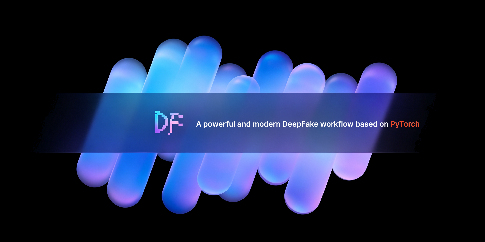
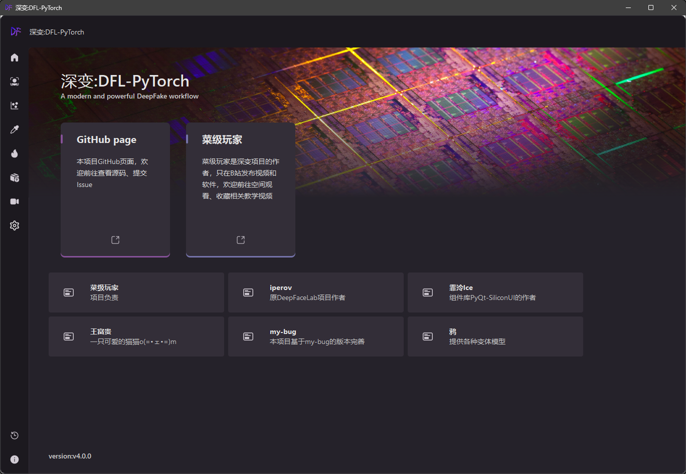
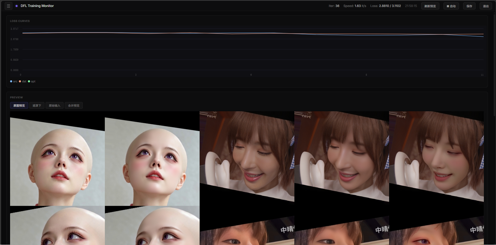
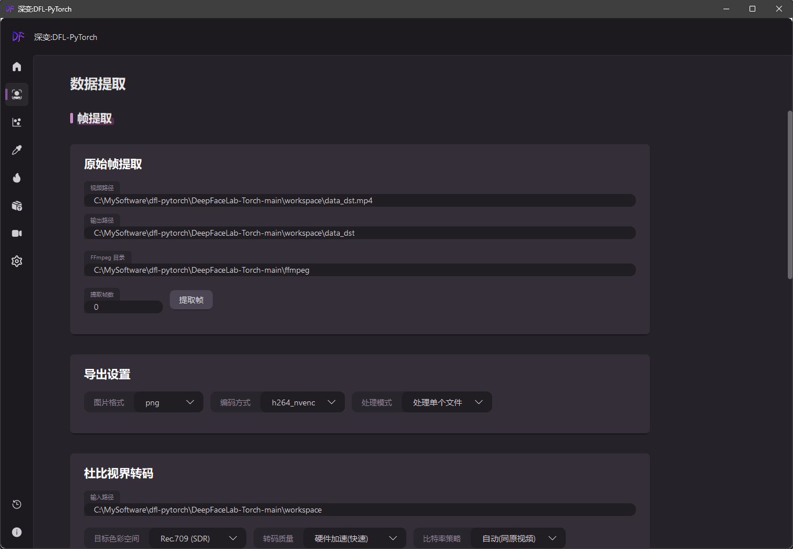
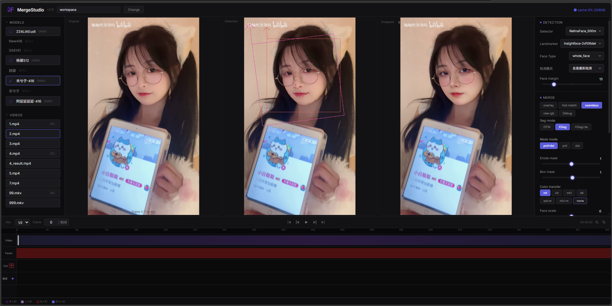
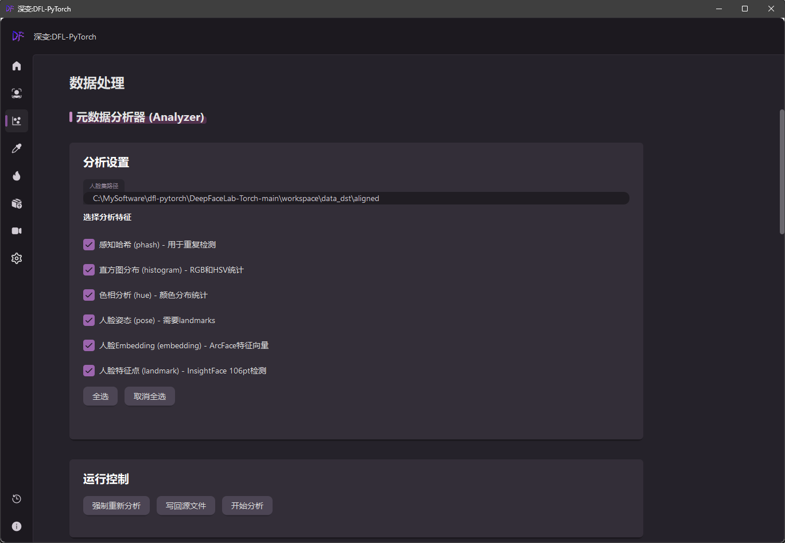
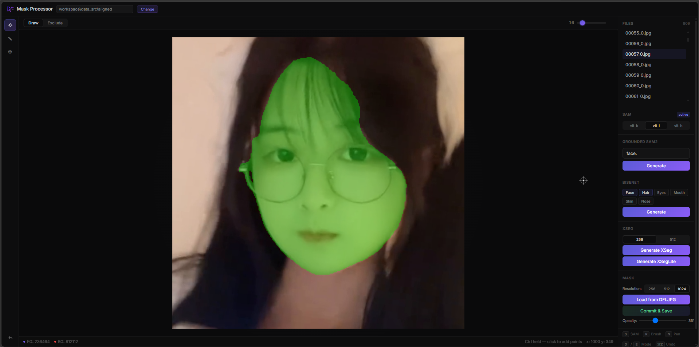

<p align="center">
  
</p>

<h1 align="center">DeepFaceLab-Torch</h1>

<p align="center">
  <em>A powerful and modern DeepFake workflow based on PyTorch</em>
</p>

<p align="center">
  <a href="README.md"></a>
  <a href="#"></a>
</p>

<br>

<p align="center">
  
</p>

<p align="center">
  
</p>

---

## Quick Start

> **Why QR code login?**  
> The first launch will prompt a Bilibili QR code login. This saves a cookie locally to unlock the **Bilibili video downloader** feature.  
> It will also automatically follow the Bilibili account **菜级玩家**. To skip:
> 
> Create `ui/user/bilibili_cookie.txt` with any content containing `SESSDATA=`:
> ```bash
> echo "SESSDATA=skip" > ui/user/bilibili_cookie.txt
> ```
> Skipping login does not affect training, extraction, or merging.

### Requirements
- Python 3.12+
- NVIDIA GPU (8GB+ VRAM recommended)
- CUDA 12.x + cuDNN 9.x

### Download Models

Model weights (detectors, landmarks, face models etc.) need to be downloaded separately:

**Baidu Pan:** https://pan.baidu.com/s/1CneT0PBmy_ARhrl4Mqp2cA?pwd=cjwj

Extract and copy the `modelhub/` directory to the project root.

### Download Pre-built Environment

Ready-to-use package with Python, dependencies and PyQt-SiliconUI pre-installed. Extract and place the `python/` folder in the project root (next to `run.bat`):

**Baidu Pan:** https://pan.baidu.com/s/1CyqR8Hw7gp6i3Dcx56Nhzw?pwd=cjwj

### Install Dependencies

```bash
pip install PyQt-SiliconUI  # https://github.com/ChinaIceF/PyQt-SiliconUI
pip install -r requirements.txt
```

### Run

```bash
python main.py
```

Or double-click `run.bat`.

---

## Project Structure

```
DeepFaceLab-Torch/
├── main.py                   # Entry
├── run.bat                   # Windows launcher
│
├── python/                   # Embedded Python environment (extract to project root)
│   ├── python.exe            # Python interpreter
│   ├── Lib/site-packages/    # Pre-installed dependencies
│   └── Scripts/              # CLI tools
│
├── models/                   # Training models
│   ├── Model_SAEHD/          # SAEHD trainer
│   ├── Model_DeepFakeLarge/  # DFLarge trainer
│   ├── Model_LIAELarge/      # LIAELarge trainer
│   └── ModelBase.py          # Base class
│
├── modelhub/                 # AI models (download separately)
│   └── onnx/                 # ONNX models
│
├── mainscripts/              # Core scripts
│   ├── Trainer.py            # Trainer logic
│   ├── Extractor.py          # Face extraction (deprecated)
│   └── Merger.py             # Merger
│
├── Extractor/                # Face extractor module
│   ├── Extractor.py          # Main program
│   └── strings.py            # I18n
│
├── MergeStudio/              # Merger (Web UI)
│   ├── api/                  # FastAPI backend
│   └── core/                 # Merge engine
│
├── DataAugmenter/            # Data augmentation
│   ├── XSegAugmenter.py      # XSeg/XSegLite mask applier
│   └── __main__.py           # CLI entry
│
├── ui/                       # PyQt6 GUI
│   ├── components/
│   │   ├── page_trainer/     # Trainer page
│   │   ├── page_data_extraction/ # Data extraction
│   │   └── page_bilibili_downloader/
│   └── img/
│
├── WebUI/                    # Web management
├── xlib/                     # Utilities
│   └── trt.py                # TensorRT wrapper
│
├── tools/                    # Tool scripts
│   ├── tonemap_aligned_faces.py  # HDR tone mapping for faces
│   ├── export_onnx_to_trt.py     # ONNX → TRT compiler
│   └── pack_source.py            # Source packer
│
├── samplelib/                # Sample loader
├── facelib/                  # Face processing
├── DFLIMG/                   # DFL image format
├── core/                     # Core runtime
│   ├── leras/                # NN layers & optimizers
│   ├── interact.py           # CLI interface
│   └── osex.py               # OS utils
│
└── ffmpeg/                   # FFmpeg (download separately)
    └── ffmpeg.exe
```

---

## Modules

### 🏋️ Trainer



Supported models:

| Model | Description |
|---|---|
| **SAEHD** | Standard face swap (DF/LIAE) |
| **DeepFakeLarge** | Large model |
| **LIAELarge** | LIAE large model |
| **XSeg** | High-precision mask model |
| **XSegLite** | Lightweight mask model (original) |

**Training features:**
- BF16 mixed precision
- Crash detector (auto-rollback)
- Fast data loader (multi-thread async)
- Cosine Annealing LR
- Lion optimizer
- VGG perceptual loss

---

### ⚡ XSegLite (Original)

Completely self-developed lightweight mask model, independent from original DeepFaceLab.

**Performance (RTX 3080):**

| Model | ONNX (CUDA) | TensorRT FP16 |
|---|---|---|
| Original XSeg (iperov) | ~10.4ms (96fps) | ~7.0ms (143fps) |
| **XSegLite** | **2.5ms (395fps)** | **1.46ms (684fps)** |

**Features:**
- SimpleGate activation + FP32 precision lock for quality
- Per-layer precision control (BF16 Conv + FP32 sensitive layers)
- Fully compatible with XSeg, can replace original XSeg
- Only 32MB (TRT engine)

**Download ready-to-use models:**

| Model | Download | Mirror |
|---|---|---|
| XSeg | [xseg.onnx](https://huggingface.co/thinkanameishard/xseg/resolve/main/xseg.onnx) | [Mirror](https://hf-mirror.com/thinkanameishard/xseg/resolve/main/xseg.onnx) |
| XSegLite | [xseglite.onnx](https://huggingface.co/thinkanameishard/xseg/resolve/main/xseglite.onnx) | [Mirror](https://hf-mirror.com/thinkanameishard/xseg/resolve/main/xseglite.onnx) |

Place in `workspace/model/XSeg/` (XSeg) and `workspace/model/XSegLite/` (XSegLite).

XSegLite trainer at `models/Model_XSegLite/`, inference integrated in `DataAugmenter/XSegAugmenter.py`.

### 🔍 Face Extractor

14 detectors + 5 landmarkers with TensorRT acceleration.

**Detectors:** BlazeFace / CenterFace / DamoFD / LightweightFD / MogFace / MTCNN / RetinaFace(10g/500m) / S3FD / TinyMog / ULFD / YoloV5Face / YoloV8Face / YoloV11nFace

**Landmarkers:** insightface-2d106det / 2DFAN-4 / 3DFAN-4 / insightface-3d68 / Google-mediapipe / OpenSeeFace / PFLD / MobileFaceNet

**Modes:**
- **Standard (fast)** — bt709 output, full speed, post-process tone mapping
- **HDR Precise (slow)** — libplacebo tone mapping in pipe, 4K output, accurate colors



### 🎬 MergeStudio

Web UI merger with multi-track timeline.

- Real-time preview
- Multi-angle face detection & swapping
- XSeg/XSegLite masks
- Color fusion (mkl/sot/rct/lct/idt)
- FFmpeg hardware encoding (NVENC)
- Dolby Vision input support



### 📊 Data Processing

**Frame extraction (`ui/components/page_data_extraction/`):**
- FFmpeg extraction (CUDA decode)
- Pixel format / color range / color space control
- Dolby Vision transcoding (HDR→Rec.709 / Rec.2020)

**Face extraction (`Extractor/`):**
- Batch face detection & alignment (14 detectors)
- Pre-scaling / frame skip / multi-angle
- TRT acceleration
- HDR tone mapping post-process

**Dataset tools (`mainscripts/`):**

| Tool | Purpose |
|---|---|
| `FacesetResizer.py` | Batch resize faces |
| `FacesetEnhancer.py` | Face enhancement |
| `Sorter.py` | Sort by blur/similarity/quality |
| `VideoEd.py` | Video trim/merge/slice |
| `XSegUtil.py` | XSeg polygon label management |
| `Util.py` | Dataset pack/unpack/dedup |
| `ExportDFM.py` | Export DFM model |



### 🎨 Mask Editor & Data Augmentation

**XSeg Mask Editor (`MaskProcessor/`):**
- Web UI interactive polygon labeling
- Mask copy / remove / view
- SAM / BiseNet auto mask models
- Export for custom XSeg / XSegLite training



**DataAugmenter (`DataAugmenter/`):**
- XSeg / XSegLite mask batch application
- TensorRT / ONNX Runtime / CPU
- Multi-threaded (GPU accelerated)
- Mask invert / encoding optimization

### 🛠️ Tool Scripts

| Script | Purpose |
|---|---|
| `tonemap_aligned_faces.py` | HDR→SDR tone mapping for extracted faces |
| `export_onnx_to_trt.py` | ONNX → TRT engine compilation |
| `export_dfm.py` | Export model to DFM format |
| `unpack_pak.py` | PAK file unpacker |
| `clear_Iter_str.py` | Model data.dat cleanup |
| `update_ffmpeg.bat` | FFmpeg auto-update |

---

## FFmpeg

Recommend **gyan.dev full static build** (includes libplacebo for HDR tone mapping).

Run `update_ffmpeg.bat` or download:
- **Baidu Pan:** https://pan.baidu.com/s/13enDtjFNudUZYvnFmGA1xQ?pwd=cjwj
- **gyan.dev official:** https://www.gyan.dev/ffmpeg/builds/ffmpeg-release-full.7z

## TensorRT

```bash
pip install tensorrt==10.0.1
python tools/export_onnx_to_trt.py --name model_name --batch 1
```

## FAQ

**Q: Where to download models?**
A: Baidu Pan: https://pan.baidu.com/s/1CneT0PBmy_ARhrl4Mqp2cA?pwd=cjwj

**Q: Which FFmpeg do I need?**
A: gyan.dev full static build (with libplacebo). Run `update_ffmpeg.bat`.

**Q: HDR video colors look wrong?**
A: In Face Extractor → HDR mode, select "HDR Precise" for libplacebo in-pipe tone mapping.

**Q: Running out of VRAM during training?**
A: Reduce batch size, enable gradient checkpointing, use BF16 mixed precision.

**Q: How to use TensorRT?**
A: Install TensorRT, then enable "Use TRT" in trainer/extractor settings.

---

## Community

- **QQ Group:** 191017993
- **Bilibili:** https://space.bilibili.com/500398541

---

## License

Licensed under **GPL-3.0**. See [LICENSE](LICENSE).

---

## Credits

- Original DeepFaceLab (iperov) — https://github.com/iperov/DeepFaceLab
- UI framework PyQt-SiliconUI (ChinaIceF) — https://github.com/ChinaIceF/PyQt-SiliconUI
- PyTorch community
- All contributors
